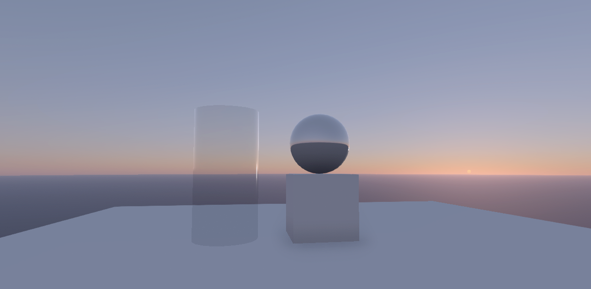

# Bruneton's Improved Atmospheric Scattering for Unity

A physically-based atmospheric skybox shader for Unity. Based on work by [Eric Bruneton](https://github.com/ebruneton/precomputed_atmospheric_scattering) and [Scrawk](https://github.com/Scrawk/Brunetons-Improved-Atmospheric-Scattering).

## Requirements

This tool requires a graphics card that supports the following Unity features:
- Compute Shader
- Texture3D
- RenderTexture

## Usage

### 1. Generating the atmosphere

1. Select "DSS/Atmosphere/Generate" from the menu bar.
2. Set the precomputation parameters as desired.
3. Press "Precompute".
4. Choose paths to save the generated material and textures.

### 2. Using it as a skybox

1. Select "Window > Lighting > Settings" from the menu bar.
2. Locate the "Environment" heading in the lighting window.
3. Drag generated material into the *Skybox Material* slot.
4. Drag your scene's main directional light into the "Sun Source" slot.

## A note on color space

- For best results, ensure that your projects color space is set to **linear**, rather than gamma.
- If you are using the tonemap post-processing effect, then be sure to disable the **tonemap** checkbox on the material.

## Results

